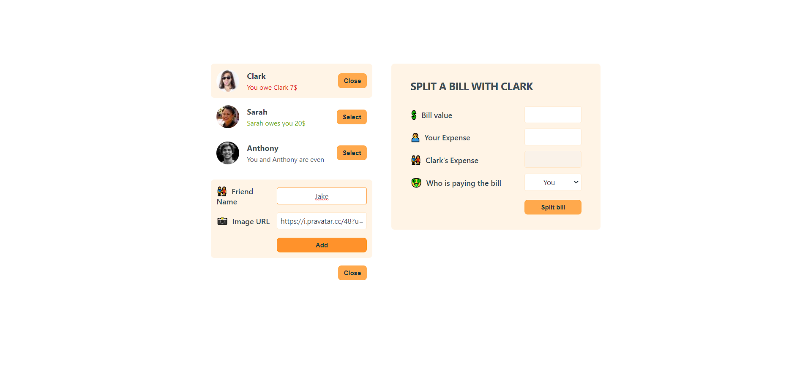
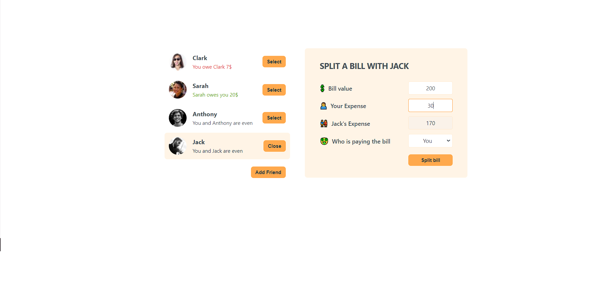

# Bill Splitter App

-Beginner friendly project for practicing state-props-forms on react.

-The Bill Splitter App is a React-based web application that helps you keep track of shared expenses among friends. With this app, you can easily split bills, see who owes whom, and maintain a balanced financial relationship within your group.

## Features

- View a list of friends and their current balances.
- Add new friends to the list with their names and profile pictures.
- Select a friend to split a bill with.
- Enter the bill value and your expense to calculate the amount owed by you and your selected friend.
- Choose who will pay the bill from a dropdown menu.
- Automatically updates the balances based on the bill split.
- Provides real-time feedback on who owes money and who is owed.

Screenshots:

adding friend

splitting bill

after the split

